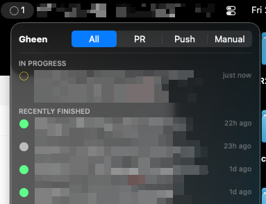

# Gheen

A tiny macOS menubar app that notifies you when a GitHub Actions run **you triggered** finishes (✅ success / ❌ failure / ⚪️ cancelled).

It reuses your existing `gh` CLI login — no separate auth, no tokens to manage.



## Prerequisites

- Apple Silicon Mac, macOS 13+
- [GitHub CLI](https://cli.github.com) installed and logged in (`gh auth status`)
- Xcode command line tools — `xcode-select --install`

## Build & run

```sh
make run        # build + launch (recommended)
make build      # build only
make clean      # remove Gheen.app
```

Or directly: `bash build.sh` (compiles, signs, and launches in one step).

A menubar icon appears (no Dock icon). Approve the notification permission prompt on first launch.

## Installing on another Mac

Gheen is ad-hoc signed (not notarized), so you can't distribute it via the App Store. Two options:

**Option A — Build from source (cleanest)**

```sh
# On the target Mac:
xcode-select --install          # if not already done
brew install gh && gh auth login
git clone <your-repo> gheen && cd gheen
make run
```

**Option B — Transfer the binary**

```sh
# On the source Mac:
make install                    # copies Gheen.app to /Applications

# AirDrop /Applications/Gheen.app to the target Mac, then on the target:
xattr -dr com.apple.quarantine /Applications/Gheen.app   # clear Gatekeeper flag
open /Applications/Gheen.app
```

The target Mac still needs `gh` installed and authenticated (`gh auth login`).

> **No notifications?** Check System Settings → Notifications → Gheen. If missing, move `Gheen.app` to `/Applications` and relaunch — macOS restricts notification registration for apps outside standard paths.

## Usage

1. Click the menubar icon → **Settings**.
2. Add repos to watch as `owner/repo` (e.g. `amree/myproject`).
3. Gheen polls each repo for runs you triggered. In-progress runs show in the dropdown; you get a notification when each finishes. Click a run (or its notification) to open it in the browser.
4. Use the **All / PR / Push / Manual** filter tabs at the top of the dropdown to narrow the list by trigger type.
5. Hover over a PR row to see the PR title as a tooltip.
6. **Quit** from the dropdown footer.

## How it works

- Polls `gh run list -R <repo> -u <you> -L 100 --json ...` every 60s (configurable).
- **Exponential backoff when idle**: if no active runs are detected, the poll interval doubles each cycle (60s → 120s → 240s → … → 10 min cap). Opens back to the configured interval when you click the menubar icon or an active run appears.
- Notifies on the active→completed transition, keyed by `databaseId#attempt` so reruns notify again; the first poll is a silent baseline.
- Dependabot version-update runs (event `dynamic`) and scheduled cron runs (event `schedule`) are filtered out — GitHub's `-u` actor filter returns them even though you didn't trigger them.
- Menubar icon: `○` idle / `◌` active / `●` red (failure stays red until you open the dropdown).
- PR rows show branch name + workflow; push/manual rows show the run's display title + branch + workflow. Each row shows a relative time (e.g. `5m ago`) on the right.

## Command log

Every `gh` call is logged to `~/Library/Logs/Gheen/commands.log` (last 100 kept), one line each:

```
2026-07-26 16:49:14  gh run list -R owner/repo -u you -L 100 --json …  (3.76s, exit 0)
```

Each line records the local time, command, duration, and exit status (or `timeout`). Polls that make no `gh` call are logged too, so a gap between timestamps means a real stall — not one of these:

```
2026-07-26 16:54:52  idle — next poll in 120s
2026-07-26 16:55:10  idle — no repos watched
2026-07-26 16:55:41  poll skipped — previous still running
```

Open the log from **Settings → Open Command Log**.

## MVP limitations

- **Apple Silicon only** (`-target arm64-apple-macosx13.0`). Universal binary is a future step.
- Only runs **you triggered** (`-u <you>`) — scheduled/other-user runs are excluded by design.
- On a very busy repo, a long run can fall out of the latest 100 before completing and be missed.
- Single `github.com` account.

## Layout

```
Sources/Gheen/   Swift sources (App, Monitor, GitHubClient, views, models)
Resources/       Info.plist
Makefile         build / run / clean / install targets
build.sh         compile → bundle → sign → launch (single script alternative)
```
